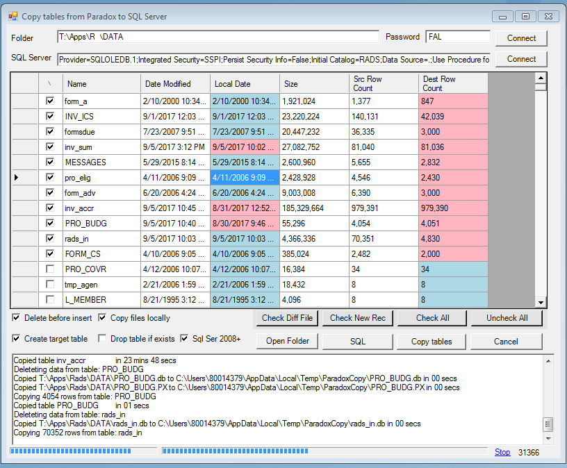
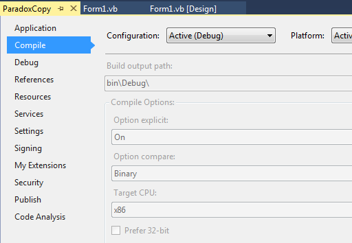

# Paradox to SQL Server

Originally posted here:
<https://www.codeproject.com/Articles/1206864/Paradox-to-SQL-Server/>

## Introduction
I developed this application to help me migrate Paradox database to SQL Server. I hope someone else will also find this code useful.

## Background
This application uses the "Paradox database native .NET reader" library developed by Petr Briza. 
It is fairly simple: you select the folder where Paradox database files reside, select the SQL Server database you want to copy the tables, 
select the tables you want to copy and click "Copy tables". The application will create tables in the SQL server database and copy the data. 
It will also try to copy files locally in case they are located on a network drive.



## Using the Code
The application uses Petr Briza library to do records counts for each table. It uses Microsoft Jet OLEDB provider to read data in 32 bit mode. The provider will not work in 64 bit. This is why it is compiled in 32 bit mode.



Pradox DB files can be password protected. The application uses JET OLEDB connection string property "Jet OLEDB:Database Password" for the password.

```
    Function GetParadoxConnectionString(ByVal sFolderPath As String, ByVal sPassword As String) As String
        If sFolderPath = "" Then
            Return ""
        End If

        If sPassword <> "" Then
            Return "Provider=Microsoft.Jet.OLEDB.4.0;Data Source=" & sFolderPath & ";_
            Extended Properties=Paradox 5.x;Jet OLEDB:Database Password=" & sPassword & ";"
        Else
            Return "Provider=Microsoft.Jet.OLEDB.4.0;Data Source=" & sFolderPath & ";_
            Extended Properties=Paradox 5.x;"
        End If
    End Function
```

CopyTableJet function does the actual work of copying data. It will insert 1000 records at a time if you select "SQL Ser 2008+".

```
    Private Sub CopyTableJet(ByVal sTableName As String, dr As OleDbDataReader, _
    ByRef cnDst As OleDbConnection)

        Dim oSchemaRows As Data.DataRowCollection = dr.GetSchemaTable.Rows
        Dim sRow As String
        Dim i As Integer
        Dim iRow As Integer = 0
        Dim iRowCount As Integer = 0

        'Get Header
        Dim sHeader As String = ""
        For i = 0 To oSchemaRows.Count - 1
            Dim sColumn As String = oSchemaRows(i)("ColumnName")
            If i <> 0 Then
                sHeader += ", "
            End If
            sHeader += PadSqlColumnName(sColumn)
        Next

        Dim sValues As String = ""

        While dr.Read()
            iRowCount += 1
            sRow = ""

            For i = 0 To oSchemaRows.Count - 1
                If sRow <> "" Then
                    sRow += ", "
                End If

                sRow += GetValueString(dr.GetValue(i))
            Next

            If chkSQL2008.Checked Then
                If sValues <> "" Then sValues += ", "
                sValues += "(" & sRow & ")"

                If iRowCount >= 1000 Then
                    Dim sSql1 As String = "INSERT INTO " & PadSqlColumnName(sTableName) & _
                                          " (" & sHeader & ") VALUES " & sValues
                    OpenConnections(cnDst)
                    ExecuteSql(sSql1, cnDst)
                    iRowCount = 0
                    sValues = ""
                End If
            Else
                Dim sSql1 As String = "INSERT INTO " & PadSqlColumnName(sTableName) & _
                                      " (" & sHeader & ") VALUES (" & sRow & ")"
                OpenConnections(cnDst)
                ExecuteSql(sSql1, cnDst)
            End If

            iRow += 1
            ProgressBar1.Value = Math.Min(ProgressBar1.Maximum, iRow)
            lbCount.Text = iRow.ToString()
            lbCount.Refresh()

            'Listen for the user to press Cancel button
            Windows.Forms.Application.DoEvents()
            If bStop Then
                Log("Copied table " & sTableName & " stopped. ")
                Exit While
            End If

        End While


        If chkSQL2008.Checked And sValues <> "" Then
            Dim sSql1 As String = "INSERT INTO " & PadSqlColumnName(sTableName) & _
                                  " (" & sHeader & ") VALUES " & sValues
            ExecuteSql(sSql1, cnDst)
        End If

    End Sub
```

GetCreateTableSqlFromParadox function will create the table in SQL server if it does not exist.

```
    Private Function GetCreateTableSqlFromParadox_
           (ByVal sTableName As String, dr As OleDbDataReader) As String

        Dim sb As New System.Text.StringBuilder()
        Dim oSchemaRows As Data.DataRowCollection = dr.GetSchemaTable.Rows
        Dim sKeyColumns As String = ""
        Dim i As Integer = 0

        sb.Append("CREATE TABLE " & PadSqlColumnName(sTableName) & " (" & vbCrLf)

        For iCol As Integer = 0 To oSchemaRows.Count - 1
            Dim sColumn As String = oSchemaRows(iCol).Item("ColumnName").ToString() & ""
            Dim sColumnSize As String = oSchemaRows(iCol).Item("ColumnSize").ToString() & ""
            Dim sDataType As String = oSchemaRows(iCol).Item("DATATYPE").FullName.ToString()
            Dim bAllowDBNull As Boolean = oSchemaRows(iCol).Item("AllowDBNull")    'Does not always work

            If i > 0 Then
                sb.Append(",")
                sb.Append(vbCrLf)
            End If

            sb.Append(PadSqlColumnName(sColumn))
            sb.Append(" " & PadAccessDataType(sDataType, sColumnSize))

            If bAllowDBNull Then
                sb.Append(" NULL")
            Else
                sb.Append(" NOT NULL")
            End If

            i += 1
        Next

        sb.Append(")")

        If i = 0 Then
            Return ""
        Else
            Return sb.ToString()
        End If

    End Function
```
